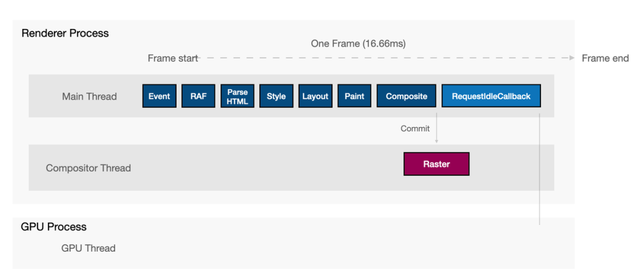

# 浏览器

## 1.浏览器进程有哪些

浏览器是多进程架构的，每个标签页是独立的渲染进程

- 浏览器主进
- **渲染进程**
  - GUI 渲染线程：渲染页面，和 JS 引擎互斥
  - JS 引擎线程：执行 JS 代码
  - 事件触发线程：主要用来控制事件循环，比如 JS 执行遇到计时器，AJAX 异步请求等，就会将对应任务添加到事件触发线程。在对应事件符合触发条件触发时，就把事件添加到待处理队列的队尾，等 JS 引擎处理
  - 定时触发器线程: setTimeout/setInterval
  - 异步 HTTP 请求线程:
- GPU 进程
- 网络进程
- 插件进程


## 2.事件循环机制

JS 是单线程的语言，只有一个执行栈，先执行当前任务，遇到异步事件就放入任务队列中，分为宏任务和微任务，当前宏任务执行完会处理所有的微任务，再从宏任务队列中取一个开始下一个宏任务。

- 渲染是下一个宏任务执行前 [https://zhuanlan.zhihu.com/p/78113300](https://zhuanlan.zhihu.com/p/78113300)


宏任务：script 标签 / 交互事件

- `setTimeout()` / `setInterval()` /`requestAnimationFrame()` /  **Node**: `setImmediate()`

微任务：

- `Promise()`  / `MutationObserver()` / `queueMicrotask()` /  **Node**: `process.nextTick()`

Node:

- `Node11`开始，每执行完一个 `timers` 类回调，例如 `setTimeout` /`setImmediate` 之后，都会把微任务给执行掉（promise 等）


## 3.浏览器存储

**Cookie**：4K，用于 HTTP 请求头，同源，每个域名 Cookie 数量不超过 20 个

- 可设置有效期（`Expires`/`Max-Age`）
- `Domain`/`Path` 定义了 Cookie 的作用域
- `Secure` 标记为只能通过 HTTPS 发送
- `HttpOnly` 无法通过 JS 访问（ Document.cookie）
- `SameSite` 限制 Cookie 在跨站请求时不会被发送，同站：**二级域名**
- 主要用于，会话状态管理，行为跟踪。
- 缺点：空间小，网络请求会携带

> 操作：document.cookie 读取/或写入，写入是追加

**LocalStorage/SessionStorage**：5M

- 浏览器提供的本地存储方法，同源策略，API 简单
- SessionStorage：当前窗口关闭就失效了，多个同源页面不共享
- localStorage：永久保存，同源页面共享
- 缺点：空间小，只能存字符串

> 方法：setItem/getItem/removeItem/clear

**IndexedDB**：用于客户端存储大量结构化数据，采用键值存储，接近 NoSQL 数据库，同源策略，支持异步，支持事务，空间大（不少于 250M）


## 4.怎么解决跨域问题

同源策略指的是：协议+域名+端口

**JSONP(手写)**

- 前端构建一个全局函数的回调 promise
- 服务端返回一个传入数据的调用函数的字符串，浏览器接收后执行

> 仅支持 get，不安全

**CORS**
跨域资源共享（CORS，Cross-Origin Resource Sharing）
在服务端允许跨域的情况下，通过 HTTP 响应头告诉浏览器当前请求允许跨域。

`简单请求`：

- 请求方法为 **GET**、**POST**、**HEAD**。
- 请求头只能使用下面的字段：
  - Accept
  - Accept-Language
  - Content-Type （只限于 text/plain、multipart/form-data、application/x-www-form-urlencoded）
  - Content-Language

任意一条要求不符合的即为`非简单请求`

- 非简单请求会先发个预检请求（Preflight）

```
- 简单请求：
请求头：Origin
响应头：Access-Control-Allow-Origin


- 预检请求
请求头：Method：OPTIONS
Access-Control-Request-Headers:content-type
Access-Control-Request-Methods:POST

响应头:
Access-Control-Allow-Headers: content-type
Access-Control-Allow-Origin: *
Access-Control-Request-Methods: POST,GET,OPTIONS
```

- CORS 携带 Cookie
  - 预检的响应头里要 `Access-Control-Allow-Credentials: true`
  - `Access-Control-Allow-Origin 不能为空
  - 在请求中设置 `withCredentials`

**代理转发**

- 正向代理
- 反向代理


## 5.浏览器缓存

浏览器缓存查找优先级：Service Worker / Memory Cache（浏览器自己控制） / Disk Cache（**HTTP 缓存**） / Push Cache（HTTP2）

**HTTP 缓存**：
**强缓存**：

- 1.0 响应头 `Expires`
- `Pragma:nocache`
- 1.1 `Cache-Control: max-age;no-store/no-cache;private/public`
- 没有缓存，浏览器会启发式缓存，

**协商缓存**：

- `Last-modified / If-Modified-Since`
- `Etag / If-None-Match`

F5: html 走`max-age=0`, 其他走缓存机制

ctrl+F5: `Cache-Control:no-cache;Pragma:no-cache`

`max-age=0`会走协商缓存，`no-cache` 重新请求


## 6.浏览器渲染过程

关键渲染路径（CRP）：创建DOM树/创建CSSOM树 - 生成渲染树 - 布局 - 绘制


- 解析 HTML 和 CSS 分别生成 `DOM 树`和 `CSSOM 树`
- 组装成 `render 树`，只添加可见的节点
- `布局Layout` ：计算出 节点的布局信息（大小和位置）,生产布局树
- 通过布局树，进行分层生成图层树
- `绘制`：为每个图层生成绘制列表，绘制节点的外观（颜色等）等
- `合成`：将图层划分图块，光栅化（转位图），发送绘制命令浏览进程，渲染显示


> 结合性能优化回答


> CSS会阻塞渲染吗
>
> - CSS 不会阻塞 DOM 解析（link 在 head 中）
> - CSS 会阻塞 DOM 树的渲染（阻塞 render tree 的形成）
> - 会阻塞后面的 JS 的执行（JS 可以更改 DOM 样式）
>


## 7.rAF/rIC

- `requestAnimationFrame`：告诉浏览器在下一次绘制之前执行
- `requestIdleCallback`：在浏览器空闲的事件执行


